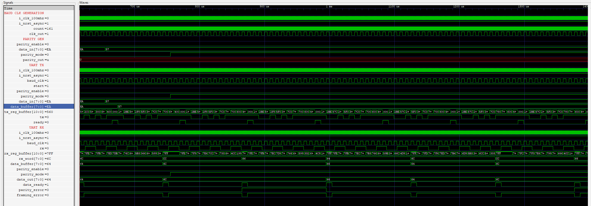

# UART - Universal Asynchronous Receiver and Transmitter

- RTL Design of UART in VHDL.
## Building Blocks
- 1. Baud Clk Generator : Generate a baud_clk from the system clk based on the required baud rate.
  2. Parity Generator   : Supports with both even, odd and also no parity.
  3. UART_TX            : Transmits the data in the following fashion
     - If parity_enable = '1' then start_bit | data_bits | parity_bit | stop_bit.
     - Else its start_bit | data_bits | stop_bit | stop_bit. The stop bit was used twice to keep symmetry of the tx_reg_buffer's size.
  4. UART_RX            : The receiver feeds the data into a shift register where its checked for start_bit stop_bit and then compared with the parity bit to check if the data received is correct. Once the correct data is received the buffer that stores the incoming data is set to (others => '1') and the process repeats.
- In the image below the parity_enable = '0' 

